# Movie Cookie

## 0. 목차

1. [개요](#1-개요)
2. [배포 URL 및 사용한 기술스택](#2-배포-url-및-사용한-기술스택)
3. [코딩 컨벤션](#3-코딩-컨벤션)
4. [역할 분담 및 개발 일정](#4-역할-분담-및-개발-일정)
5. [프로젝트 구조](#5-프로젝트-구조)
6. [UI 목업](#6-ui-목업)
7. [요구사항 분석 및 구현 기능 설명](#7-요구사항-분석-및-구현-기능-설명)
8. [기능 시연](#8-기능-시연)
9. [어려웠던 점 및 소감](#9-어려웠던-점-및-소감)

## 1. 개요

-   **Movie Cookie**는 영화와 관련된 웹사이트 입니다.
-   영화 정보 검색, 영화 추천, 회원 간 커뮤니티 기능이 있습니다.

## 2. 배포 URL 및 사용한 기술스택

### 2-1. 배포 URL

> 링크: http://13.125.92.100/

```
<TEST 계정>
아이디: test1234
비밀번호: testest1234
```

### 2-2. GitHub 레포지토리 주소

-   **Back-End**

    > https://github.com/team-gingerbread/movie-cookie

-   **Front-End**
    > https://github.com/team-gingerbread/movie-cookie-fe

### 2-3. 사용한 기술스택

-   **Back-End**

    -   개발<br>
         

    -   배포<br>
          

-   **Front-End**

    -   개발<br>
          

    -   배포<br>
         

## 3. 코딩 컨벤션

### 3-1. 네이밍 컨벤션

-   **snake_case** : Python 변수, 함수, 파일명, 폴더명
-   **PascalCase** : 클래스
-   **camelCase** : JavaScript 변수, 함수
-   **kebab-case** : URL, HTML, CSS
-   **UPPER_CASE** : 상수
-   **is_variable** : Boolean 값
-   **$variable** : JavaScript HTML DOM 조작

### 3-2. Gitmoji 메시지

-   commit 메시지: "{gitmoji} {형식}: {내용}"
    -   예시 : **"✨ADD: post app 생성"**
-   형식: ADD, REMOVE, MOVE, UPDATE
-   gitmoji
    -   [🎉] : 프로젝트 첫 시작
    -   [✨] : 기능 추가
    -   [⚡] : 기능 업데이트
    -   [🐛] : 버그 수정
    -   [🎨] : 코드 형식 정리
    -   [💄] : UI 스타일 추가
    -   [🔥] : 파일 제거
    -   [🚚] : 파일 이동
    -   [🚀] : 배포 관련
    -   [📝] : README 작성

### 3-3. GitHub 브랜치 전략

-   **GitHub Flow** 전략 사용
-   배포용 브랜치 : **main**
-   개발용 브랜치 : **dev**
-   기능 추가 / 버그 수정 : GitHub Issue를 생성하여 개별 브랜치 생성, 작업 완료 후 dev 브랜치로 Pull Request & Merge
-   개발이 완료된 브랜치는 삭제
-   배포 단계에 main 브랜치로 dev 브랜치를 Merge
-   GitHub Action을 이용하여 main 브랜치 배포 자동화

## 4. 역할 분담 및 개발 일정

### 4-1. 역할 분담

| 박종훈    | 김윤재   | 이병관    | 편해선    |
| --------- | -------- | --------- | --------- |
| 영화 정보 | 커뮤니티 | 회원 관리 | 영화 추천 |

-   영화 정보 (박종훈)

    -   영화 정보 검색(KMDB API 이용)
    -   영화 한줄평 기능
    -   선호 영화 표시 기능

-   커뮤니티 (김윤재)

    -   회원 간의 커뮤니티
    -   영화와 관련된 사용자 게시판 기능
    -   커뮤니티의 댓글, 대댓글 기능

-   회원 관리 (이병관)

    -   서비스 이용자의 계정 생성 및 관리
    -   JSON Web Token을 이용한 사용자 인증 기능
    -   사용자의 프로필 관리 기능

-   영화 추천 (편해선)
    -   사용자에게 알맞은 영화 추천
    -   KMDB와 박스오피스 데이터를 사용한 추천도 계산
    -   추천 영화 저장 기능

### 4-2. 개발 일정

-   GitHub Project, WBS로 일정 관리

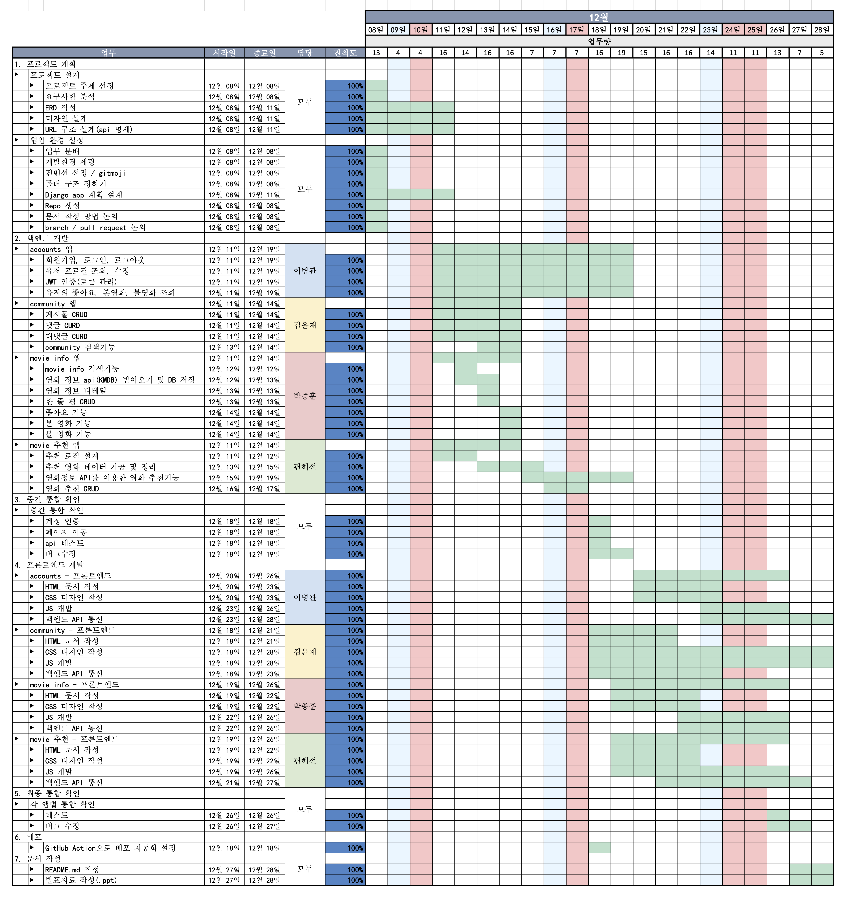

## 5. 프로젝트 구조

### 5-1. 폴더 구조

-   **Back-End**

```
📦movie-cookie
 ┣ 📂.vscode
 ┃ ┗ 📜settings.json
 ┣ 📂__pycache__
 ┣ 📂accounts
 ┃ ┣ 📂__pycache__
 ┃ ┣ 📂migrations
 ┃ ┃ ┣ 📂__pycache__
 ┃ ┃ ┣ 📜0001_initial.py
 ┃ ┃ ┣ 📜0002_initial.py
 ┃ ┃ ┗ 📜__init__.py
 ┃ ┣ 📜__init__.py
 ┃ ┣ 📜admin.py
 ┃ ┣ 📜apps.py
 ┃ ┣ 📜models.py
 ┃ ┣ 📜permissions.py
 ┃ ┣ 📜serializers.py
 ┃ ┣ 📜tests.py
 ┃ ┣ 📜urls.py
 ┃ ┗ 📜views.py
 ┣ 📂community
 ┃ ┣ 📂__pycache__
 ┃ ┣ 📂migrations
 ┃ ┃ ┣ 📂__pycache__
 ┃ ┃ ┣ 📜0001_initial.py
 ┃ ┃ ┗ 📜__init__.py
 ┃ ┣ 📜__init__.py
 ┃ ┣ 📜admin.py
 ┃ ┣ 📜apps.py
 ┃ ┣ 📜models.py
 ┃ ┣ 📜serializers.py
 ┃ ┣ 📜tests.py
 ┃ ┣ 📜urls.py
 ┃ ┗ 📜views.py
 ┣ 📂config
 ┃ ┣ 📂__pycache__
 ┃ ┣ 📜__init__.py
 ┃ ┣ 📜asgi.py
 ┃ ┣ 📜settings.py
 ┃ ┣ 📜urls.py
 ┃ ┗ 📜wsgi.py
 ┣ 📂movieinfo
 ┃ ┣ 📂__pycache__
 ┃ ┣ 📂migrations
 ┃ ┃ ┣ 📂__pycache__
 ┃ ┃ ┣ 📜0001_initial.py
 ┃ ┃ ┣ 📜0002_delete_gptanalysis.py
 ┃ ┃ ┗ 📜__init__.py
 ┃ ┣ 📜__init__.py
 ┃ ┣ 📜admin.py
 ┃ ┣ 📜apps.py
 ┃ ┣ 📜models.py
 ┃ ┣ 📜permissions.py
 ┃ ┣ 📜serializers.py
 ┃ ┣ 📜tests.py
 ┃ ┣ 📜urls.py
 ┃ ┣ 📜utils.py
 ┃ ┗ 📜views.py
 ┣ 📂recommend
 ┃ ┣ 📂__pycache__
 ┃ ┣ 📂migrations
 ┃ ┃ ┣ 📂__pycache__
 ┃ ┃ ┣ 📜0001_initial.py
 ┃ ┃ ┗ 📜__init__.py
 ┃ ┣ 📜__init__.py
 ┃ ┣ 📜admin.py
 ┃ ┣ 📜apps.py
 ┃ ┣ 📜cron.py
 ┃ ┣ 📜models.py
 ┃ ┣ 📜permissions.py
 ┃ ┣ 📜schema_examples.py
 ┃ ┣ 📜serializers.py
 ┃ ┣ 📜tests.py
 ┃ ┣ 📜urls.py
 ┃ ┗ 📜views.py
 ┣ 📂static
 ┃ ┣ 📜foreign.csv
 ┃ ┗ 📜korean.csv
 ┣ 📜.env
 ┣ 📜.gitignore
 ┣ 📜README.md
 ┣ 📜cron.log
 ┣ 📜manage.py
 ┣ 📜requirements.txt
 ┗ 📂venv
```

-   **Front-End**

```
📦movie-cookie-fe
 ┣ 📂.vscode
 ┃ ┗ 📜settings.json
 ┣ 📂accounts
 ┃ ┣ 📂login
 ┃ ┃ ┗ 📜index.html
 ┃ ┣ 📂mypage
 ┃ ┃ ┗ 📜index.html
 ┃ ┣ 📂mypage-edit
 ┃ ┃ ┗ 📜index.html
 ┃ ┣ 📂script
 ┃ ┃ ┣ 📜login.js
 ┃ ┃ ┣ 📜mypage-edit.js
 ┃ ┃ ┣ 📜mypage.js
 ┃ ┃ ┗ 📜signup.js
 ┃ ┣ 📂signup
 ┃ ┃ ┗ 📜index.html
 ┃ ┗ 📂style
 ┃ ┃ ┣ 📜login.css
 ┃ ┃ ┣ 📜mypage.css
 ┃ ┃ ┗ 📜signup.css
 ┣ 📂community
 ┃ ┣ 📂detail
 ┃ ┃ ┗ 📜index.html
 ┃ ┣ 📂script
 ┃ ┃ ┣ 📜detail.js
 ┃ ┃ ┣ 📜index.js
 ┃ ┃ ┗ 📜write.js
 ┃ ┣ 📂style
 ┃ ┃ ┗ 📜style.css
 ┃ ┣ 📂write
 ┃ ┃ ┗ 📜index.html
 ┃ ┗ 📜index.html
 ┣ 📂img
 ┃ ┣ 📜background.jpg
 ┃ ┣ 📜default.jpg
 ┃ ┗ 📜profile_basic.png
 ┣ 📂movieinfo
 ┃ ┣ 📂detail
 ┃ ┃ ┗ 📜index.html
 ┃ ┣ 📂script
 ┃ ┃ ┣ 📜detail.js
 ┃ ┃ ┗ 📜index.js
 ┃ ┣ 📂style
 ┃ ┃ ┗ 📜style.css
 ┃ ┗ 📜index.html
 ┣ 📂recommend
 ┃ ┣ 📂detail
 ┃ ┃ ┗ 📜index.html
 ┃ ┣ 📂list
 ┃ ┃ ┗ 📜index.html
 ┃ ┣ 📂script
 ┃ ┃ ┣ 📜detail.js
 ┃ ┃ ┣ 📜list.js
 ┃ ┃ ┗ 📜recommend.js
 ┃ ┣ 📂style
 ┃ ┃ ┗ 📜recommend.css
 ┃ ┗ 📜index.html
 ┣ 📂script
 ┃ ┣ 📜base.js
 ┃ ┣ 📜token.js
 ┃ ┗ 📜url.js
 ┣ 📂style
 ┃ ┣ 📜base.css
 ┃ ┗ 📜main.css
 ┣ 📜.gitignore
 ┣ 📜README.md
 ┗ 📜index.html
```

### 5-2. 데이터베이스 ERD 구조

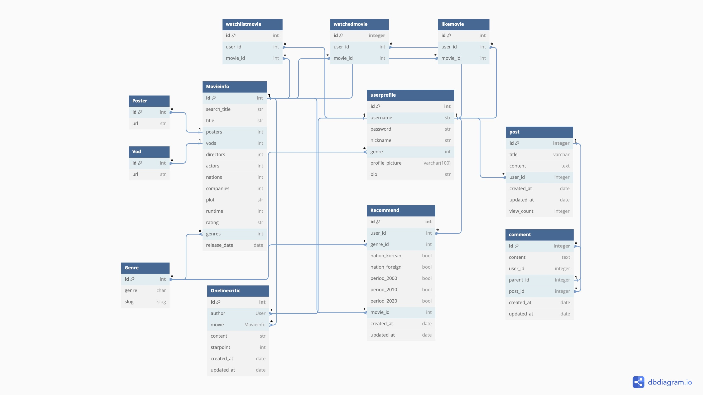

### 5-3. API 구조

| app:accounts                 | HTTP Method | 설명                       | 로그인 권한 | 사용자 본인 권한 |
| ---------------------------- | ----------- | -------------------------- | ----------- | ---------------- |
| signup/                      | POST        | 회원가입 요청              |             |                  |
| login/                       | POST        | 로그인 요청                |             |                  |
| logout/                      | POST        | 로그아웃 요청              |             |                  |
| password/change/             | POST        | 비밀번호 변경 요청         | O           | O                |
| token/refresh/               | POST        | 인증토큰 재발급 요청       | O           | O                |
| api/user-profile/`<int:id>`/ | GET         | 프로필 조회 요청           | O           | O                |
| api/user-profile/`<int:id>`/ | PATCH       | 프로필 수정 요청           | O           | O                |
| api/liked-movies/            | GET         | 좋아요 누른 영화 조회 요청 | O           | O                |
| api/watched-movies/          | GET         | 본 영화 조회 요청          | O           | O                |
| api/watchlist-movies/        | GET         | 볼 영화 조회 요청          | O           | O                |

| app:community                 | HTTP Method | 설명                       | 로그인 권한 | 작성자 권한 |
| ----------------------------- | ----------- | -------------------------- | ----------- | ----------- |
| /                             | GET         | 전체 글 리스트 요청        |             |             |
| /                             | POST        | 글 생성 요청               | O           |             |
| /?search=`<str:query>`/       | GET         | 글 검색 요청               |             |             |
| `<int:post_id>`/              | GET         | 글 내용 조회 요청          |             |             |
| `<int:post_id>`/              | PATCH       | 글 내용 수정 요청          | O           | O           |
| `<int:post_id>`/              | DELETE      | 글 내용 삭제 요청          | O           | O           |
| comments/                     | POST        | 댓글 생성 요청             | O           |             |
| comments/`<int:comment_id>`/  | PATCH       | 댓글 수정 요청             | O           | O           |
| comments/`<int:comment_id>`/  | DELETE      | 댓글 삭제 요청             | O           | O           |
| view/comments/                | GET         | 전체 댓글 조회 요청        |             |             |
| view/comments/`<int:post_id>` | GET         | 해당 글의 댓글 리스트 요청 |             |             |

| app:movieinfo                                     | HTTP Method | 설명                              | 로그인 권한 | 작성자 권한 |
| ------------------------------------------------- | ----------- | --------------------------------- | ----------- | ----------- |
| search/                                           | POST        | 영화 검색 요청                    |             |             |
| detail/                                           | GET         | 전체 영화 정보 요청               |             |             |
| detail/`<int:movie_id>`/                          | GET         | movie_id 영화 정보 상세 요청      |             |             |
| detail/`<int:movie_id>`/onelinecritic/            | GET         | movie_id 영화 한줄평 전체 요청    |             |             |
| detail/`<int:movie_id>`/onelinecritic/            | POST        | movie_id 영화 한줄평 작성 요청    | O           |             |
| detail/`<int:movie_id>`/onelinecritic/`<int:pk>`/ | PATCH       | movie_id 영화 pk 한줄평 수정 요청 | O           | O           |
| detail/`<int:movie_id>`/onelinecritic/`<int:pk>`/ | DELETE      | movie_id 영화 pk 한줄평 삭제 요청 | O           | O           |

| app:recommend | HTTP Method | 설명                              | 로그인 권한 | 사용자 본인 권한 |
| ------------- | ----------- | --------------------------------- | ----------- | ---------------- |
| genres/       | GET         | 영화 추천 후보들의 장르 목록 조회 |             |                  |
| generate/     | POST        | 영화 추천 실행                    |
| /             | GET         | 추천 받은 영화 목록 조회          | O           |                  |
| /             | POST        | 추천 받은 영화 저장               | O           |                  |
| `<int:id>`/   | GET         | 추천 정보 상세 조회               | O           | O                |
| `<int:id>`/   | PATCH       | 추천 정보 수정                    | O           | O                |
| `<int:id>`/   | DELETE      | 추천 정보 삭제                    | O           | O                |

> [Swagger로 API 테스트하기](http://52.79.54.190/api/schema/swagger-ui/) <br>

### 5-4. 배포 아키텍쳐 구조

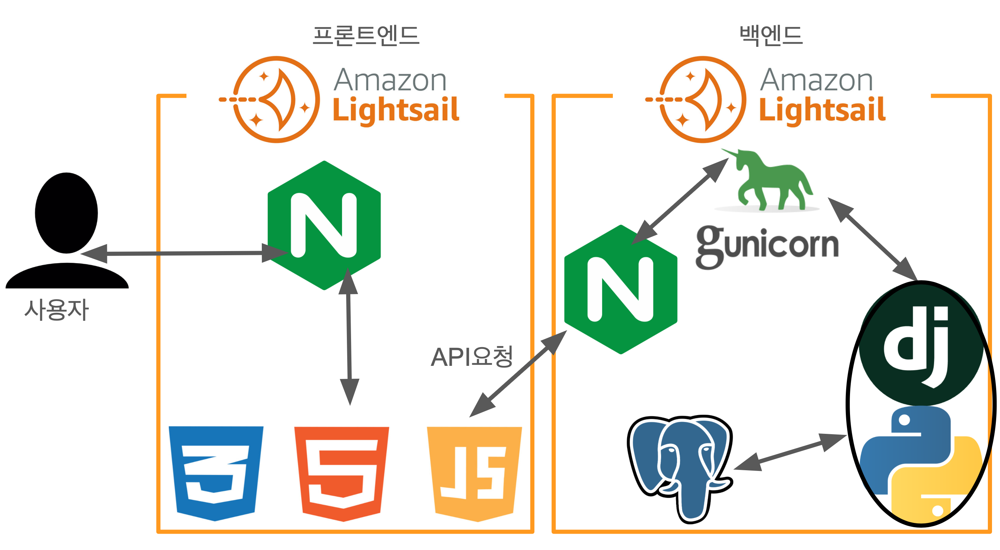

## 6. UI 목업

> [Figma 작업](https://www.figma.com/file/EIGbPjQYZGzfL36iznhRsm/Movie-Cookie?type=design&node-id=25%3A6&mode=design&t=USAO0M0PDikvYeYQ-1)

### 6-1. 메인 페이지

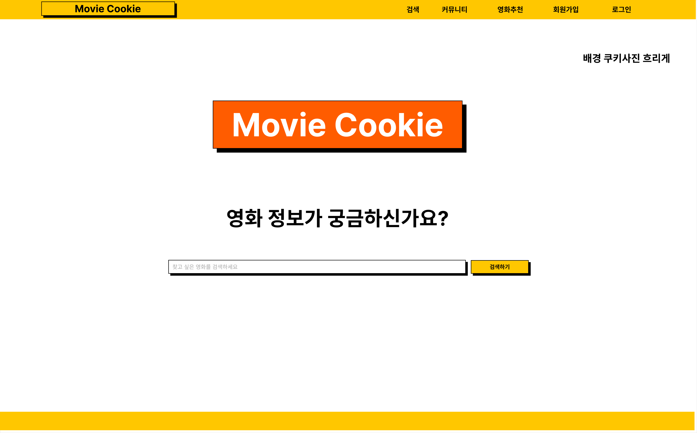

### 6-2. 회원 관리 페이지

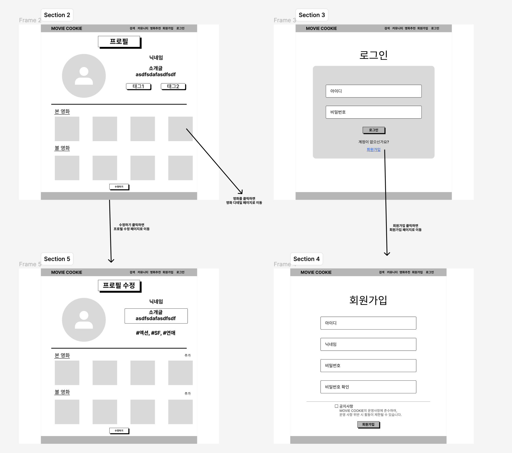

### 6-3. 커뮤니티 페이지

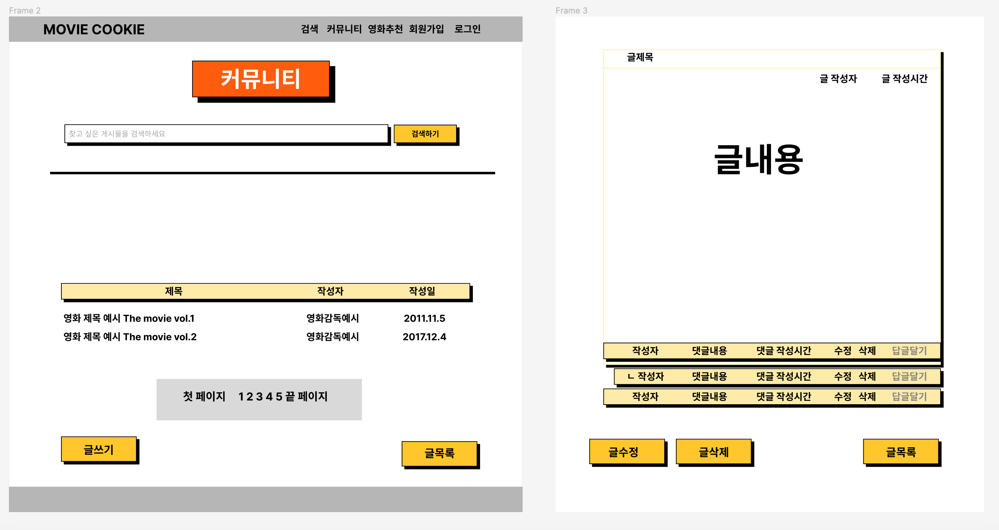

### 6-4. 영화 정보 페이지


### 6-5. 영화 추천 페이지

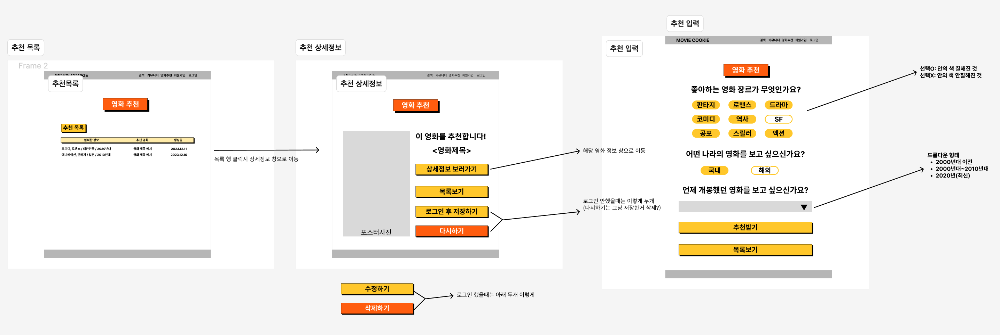

## 7. 요구사항 분석 및 구현 기능 설명

### 7-1. 기능 구현 계획 (마인드맵)

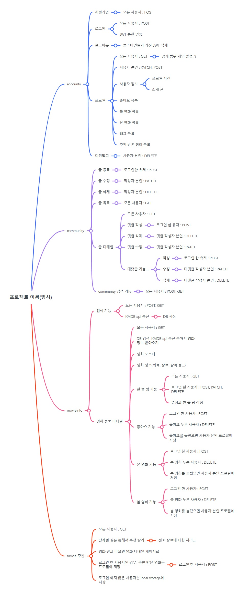

### 7-2. 기본 요구사항

-   Django REST framework를 이용하여 구현
-   클래스형 뷰로 구현 (APIView, ViewSet 활용)
-   회원 관리 기능 구현
-   기능 최소 3가지 이상 구현 : 커뮤니티, 영화 정보 검색, 영화 추천
-   CRUD 가능한 ERD 구조 설계

### 7-3. `accounts` 앱

-   JSON Web Token 인증 방식으로 구현
-   Access Token 만료 시, Refresh Token을 이용하여 Access Token 재발급
-   로그인, 회원가입, 로그아웃, 비밀번호 변경, 토큰 재발급 기능
-   사용자 본인의 프로필 조회 및 수정 가능
-   좋아요한 영화, 본 영화, 볼 영화 표시 가능

### 7-4. `community` 앱

-   회원 간의 소통을 위한 게시판 기능
-   게시글 CRUD, 댓글 및 대댓글 CRUD 기능
-   로그인 한 사용자만 글과 댓글 작성, 수정, 삭제 가능
-   로그인 여부에 상관없이 글 조회, 글 검색 가능
-   글 작성 시 사진 첨부 가능

### 7-5. `movieinfo` 앱

-   KMDB API를 이용한 영화 정보 검색 및 조회
-   영화 검색 시 KMDB API를 이용한 영화 목록을 받아 DB에 저장
-   로그인 여부 상관없이 영화 검색 및 상세 정보 조회 가능
-   로그인 한 사용자는 영화에 좋아요, 본 영화, 볼 영화 표시 가능
-   로그인 한 사용자는 영화 상세 정보에 한줄평 작성, 수정, 삭제 가능

### 7-6. `recommend` 앱

-   KMDB API와 박스오피스 API를 이용한 영화 추천 기능
-   장르, 국가(국내/해외), 연도(2000년대/2010년대/2020년대)를 선택받아 추천
-   선택한 값들로 필터링 한 후, 가중치가 높은 순, 누적관객수가 높은 순의 상위 10개 중 하나의 영화를 랜덤 추천
-   로그인 한 사용자는 본인의 선호장르와 좋아요한 영화에 따른 가중치 추가 반영
-   추천 후보 영화들은 매일 박스오피스 API를 이용하여 업데이트 가능

### 7-7. 활용한 외부 패키지

-   Django REST framework 사용
    -   djangorestframework
-   회원 인증
    -   djangorestframework-simplejwt
    -   dj-rest-auth
    -   django-allauth
-   Front-End 브라우저의 API 요청 허가
    -   django-cors-headers
-   시크릿 키, 외부 API 접근 키 관리
    -   django-environ
-   API schema 문서화
    -   drf-spectacular
-   이미지필드 변경/삭제시 기존 사진 자동삭제
    -   django-cleanup
-   영화추천을 위한 영화 순위 정보 매일 업데이트
    -   django-crontab

## 8. 기능 시연

### 8-1. 메인 페이지

-   로그인 X
    

-   로그인 O
    

-   메인 화면에서는 영화 정보 검색을 바로 할 수 있습니다.
-   로그인 여부에 따라 헤더 우측이 `로그인/회원가입`, `마이페이지/로그아웃` 으로 바뀝니다.

### 8-2. 회원 관리 기능

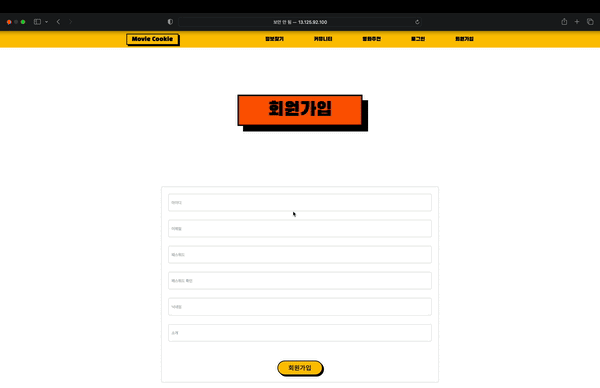

-   회원가입 페이지를 통해 회원가입이 가능합니다.
-   `아이디`, `이메일`, `비밀번호`, `닉네임`, `소개말`을 입력받습니다.

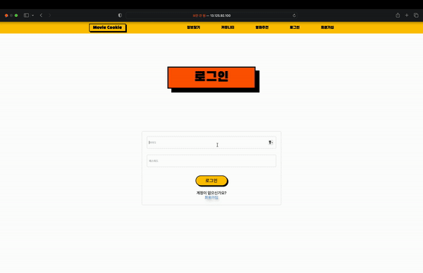

-   계정이 생긴 사용자는 `로그인`, `로그아웃`이 가능합니다.

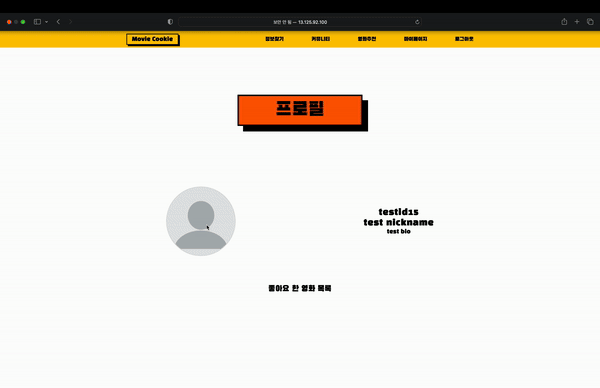

-   `마이페이지`에 들어가면, 사용자 정보가 뜹니다.
-   사진을 클릭해서 `프로필 사진`을 변경할 수 있습니다.
-   `좋아요`, `본 영화`, `볼 영화`를 체크했다면 여기에 표시가 됩니다.
-   `프로필수정` 버튼을 통해 회원정보를 수정할 수 있습니다.

### 8-3. 커뮤니티 기능

### 8-4. 영화 정보 기능


-   `KMDB API`를 이용해서 영화 정보를 검색하여 보여줍니다.
-   영화명을 선택하면 `상세정보`를 볼 수 있습니다.


-   로그인을 하지 않으면 영화 상세정보의 세 가지 버튼과 한줄평 기능 이용을 못합니다.

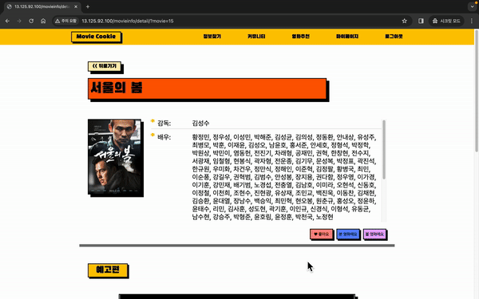

-   로그인을 한 사용자는 영화에 `좋아요`, `본 영화`, `볼 영화` 표시를 할 수 있습니다.
-   표시한 영화는 `마이페이지`에서 확인이 가능합니다.

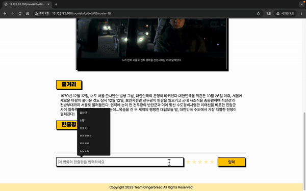

-   로그인을 한 사용자는 영화에 한줄평을 별점과 함께 남길 수 있습니다.
-   한줄평은 작성자 본인만 수정, 삭제가 가능합니다.

### 8-5. 영화 추천 기능


-   `영화추천` 탭으로 들어가면 입력페이지가 뜨고, `장르`, `국가`, `연도`를 선택하면 영화를 추천해 줍니다.
-   장르는 추천 후보 영화들의 장르를 모았고 추천 후보 영화가 업데이트 될 때 새로운 장르가 생긴다면 반영됩니다.
-   국가는 `국내`/`해외` 중에 고를 수 있습니다.
-   연도는 옛날 영화는 누적관객수 자료가 없어서 `2000년대`/`2010년대`/`2020년대`로 구분하였습니다.

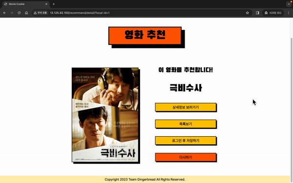

-   로그인을 하지 않은 사용자는 로컬스토리지에 결과가 저장되고, 추천결과에서 `로그인 후 저장하기`/`다시하기` 버튼이 뜹니다.
-   `로그인 후 저장하기`를 누르면, 로그인 화면으로 넘어가고, 로그인 완료 시 로컬스토리지에 저장된 결과가 데이터베이스로 저장됩니다.

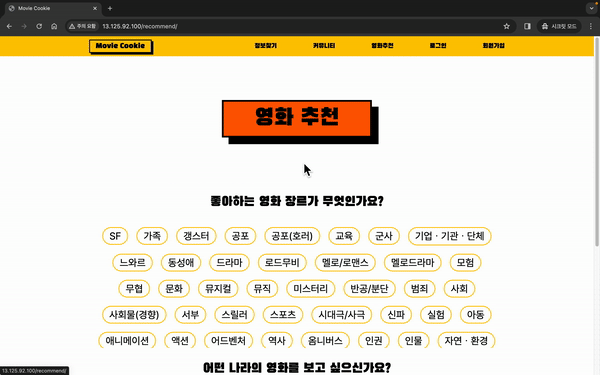

-   `다시하기`를 누르면, 로컬스토리지에 저장된 결과가 삭제되고 추천페이지로 이동하여 추천받기를 다시 이용할 수 있습니다.

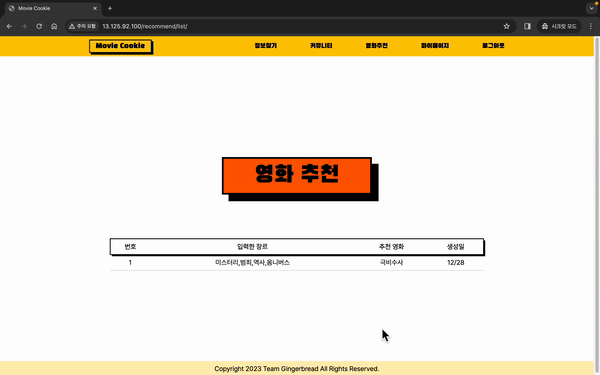

-   로그인을 한 사용자는 데이터베이스에 결과가 저장되고, 추천결과에서 `수정하기`/`삭제하기` 버튼이 뜹니다.
-   `수정하기`를 누르면, 입력페이지에 기존 입력했던 값이 선택된 채로 뜨고, 추천받기를 누르면 새로 추천된 영화로 수정되어 저장됩니다.

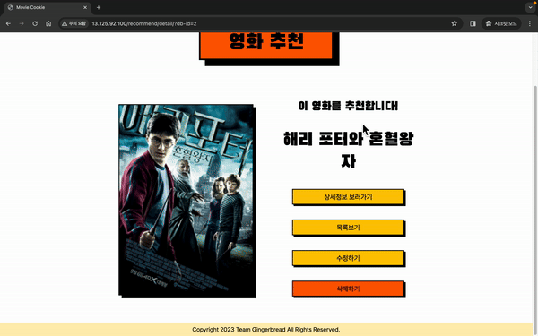

-   `삭제하기`를 누르면, 데이터베이스에서 삭제되어 목록에 다시 뜨지 않습니다.

## 9. 어려웠던 점 및 소감

### 9-1. 박종훈

-   어려웠던 점 : 검색결과가 너무 늦게 나타나는 문제

저희 서비스는 저희의 영화 정보 데이터베이스에 저장되지 않은 새로운 영화들을 `KMDB에서 데이터를 받아와 저장`했습니다.<br>
저희 데이터베이스에 저장하는 이유는, KMDB의 데이터를 복잡한 과정을 거치지 않고 저희 서비스에서 보다 사용하기 쉽게 하기 위해서 였습니다.<br>
그리고 데이터베이스로 저장은, 정규화를 적용시키기 위해 모든 데이터가 원자성을 가지도록 했습니다.<br>
그럼으로 인해 하나의 데이터를 저장할 때 `영화 하나의 데이터 + 감독의 수 + 배우의 수 + 포스터의 수 + VOD의 수 + 장르의 수 + 영화사의 수` 를 포함한 DB 저장이 발생했고,
이로인해 검색결과가 늦게 나타나는 결과가 나왔습니다.<br>
예를 들어, '해리포터'의 쿼리 검색결과가 사용자에게 전달되기까지 무려 100초가 넘는 시간이 걸리게 되었습니다.
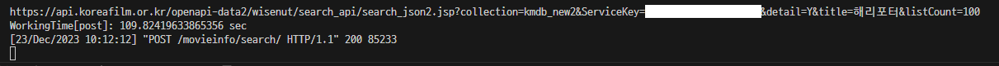

이를 해결하기 위해 데이터를 저장할 때 파이썬의 `멀티프로세싱`을 적용하여 데이터베이스의 저장을 `병렬적으로 처리`하도록 했습니다.<br>
그 결과 사용자에게 검색결과가 전달되기까지 29초의 시간이 걸리게 되었습니다.

하지만 이 또한 사용자 경험에서 아주 좋은 시간은 아니었습니다.

문제는 데이터베이스에 있었습니다.<br>
`sqlite`는 동시적으로 처리되는 데이터 베이스가 아니었고, 멀티프로세싱으로 처리되는 데이터는 sqlite에서는 무결성이 깨지는 위험성을 가지고 있었습니다.<br>
그렇기 때문에 데이터베이스를 sqlite에서 동시성 처리가 가능한 `postgreSQL`로 변경하였고, 멀티프로세싱 적용없이 데이터 베이스만 변경하는 것으로 무려, 1초대의 검색결과를 가지게 되었습니다.
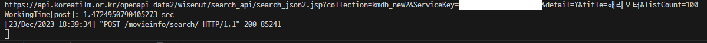
이로인해, 프로젝트의 상황에 알맞은 데이터베이스의 선택이 중요하다는 것을 알게 되었습니다.

-   소감

처음으로 여러명의 팀원들과 프로젝트를 진행했습니다.<br>
팀장을 맡아 프로젝트를 이끌었지만, 부족한 모습만 보인거 같아 팀원들에게 죄송합니다.<br>
그래도 믿고 따라와주시고, 간간히 조언을 함께 주면서 공통된 목표를 향해 다같이 노력했던 것 만큼은 잊지 못할 것 같습니다.<br>
4명이 모여서 이렇게 서비스를 만들 수 있었던 것, DRF와 여러 기술을 통해 이렇게 하나의 프로젝트를 완성할 수 있었던 것에 많이 성장할 수 있었다는 경험을 얻게 되었습니다.<br>
감사합니다.

### 9-2. 김윤재

-   어려웠던 점

-   소감

### 9-3. 이병관

-   어려웠던 점

회원 쪽을 맡게 되어 dj-rest-auth 같은 프레임워크를 사용하여
전체적인 틀은 구현에 어려움은 없었지만 `세부적인 기능의 구현`에 자잘한 오류로 시간을 오래 사용하였습니다.<br>
특히 프로필 페이지에 좋아요 한 영화, 본 영화, 볼 영화의 `포스터를 불러오는 부분`에서 오류가 났었습니다.<br>
영화정보를 JSON(id, movie, url)데이터로 가져오고 그 데이터 중에서 `movie`값으로 영화를 찾아야 하는데, `id` 값으로 영화를 찾아서 좋아요 누르지 않은 이상한 영화의 포스터만 나오는 문제가 있었습니다.<br>
처음에는 왜 이렇게 되었는지 이유를 몰라서 헤맸지만, 로그를 보면서 하나씩 찾아보니 수월하게 해결했습니다.

-   소감

팀원들과 프로젝트를 한 한 달 정도가 정말 값진 시간이었던 것 같습니다.<br>
제가 부족한 부분이 많아서 처음엔 걱정이 많았지만 조원분들의 많은 도움으로 맡은 부분을 완성할 수 있었습니다.<br>
이번 프로젝트의 경험으로 인하여 협업에 대한 걱정을 좀 덜어낸 거 같아 후련하고 이끌어주신 조원분들께 감사하다는 생각입니다.

### 9-4. 편해선

-   어려웠던 점

영화 추천을 위한 영화정보 데이터 정제 작업 때 문제가 있었습니다.<br>
영화 추천을 위해서, 입력받은 장르/국가/연도로 필터링 된 영화들을 `누적관객수` 순으로 정렬을 하려고 했습니다.<br>
특히나 비로그인 사용자의 경우에는 선호장르나 좋아요한 영화 등의 선호도를 모르므로 추천 지표가 없기 때문에 어느정도의 흥행이 보장된 영화를 추천해주기 위함이었습니다.<br>
처음 계획 시에는, `KMDB API`에 누적관객수 정보도 응답해준다고 하여서 그걸 활용할 계획이었는데, 막상 API를 사용해보니 누적관객수 필드는 있지만 **누적관객수 값이 표시된 영화가 없었습니다.**<br><br>
그래서 결국에는 영화진흥위원회의 `박스오피스 데이터`를 활용하기로 하였습니다.<br>
여기에는 누적관객수가 예전 자료부터 표기되어 있어서, 2000년대 이후의 데이터를 엑셀형식으로 다운받아 정제작업을 거쳐 csv형식으로 바꿨습니다.<br>
하지만 이건 그 데이터를 다운받은 날의 전일 까지만 가능하고 실시간으로 업데이트 되는 영화를 받아오지 않으므로 `최신 흥행 영화를 추천후보에 포함시키기 어렵다`는 단점이 생겼습니다.<br>
따라서 `django-crontab`을 활용하여 `박스오피스 API`에 매일 요청을 보내서 국내/해외 상위 10개의 영화를 받아와 `누적관객수를 업데이트` 하고, 기존 csv에 없는 영화면 KMDB API에 요청을 보내 `KMDB의 정보로 csv에 추가`하여 최신 흥행 영화도 포함되도록 보완하였습니다.

-   소감

짧으면서도 긴 시간동안 팀원들과 프로젝트를 진행하면서 다양한 경험을 했다고 생각합니다. csv데이터 정제하느라 시간을 좀 많이 쓴 것 같아서 아쉽지만 그래도 계획했던 기능은 다 구현을 하게 되어 만족합니다.
